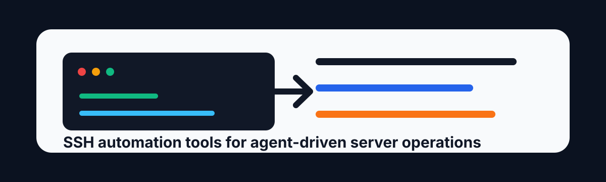

# Remote Server Manager



[](LICENSE)
[](https://www.python.org/)
[](https://www.paramiko.org/)
[](SKILL.md)

Remote Server Manager is a lightweight agent skill for managing Linux servers over SSH from non-interactive coding assistants. It wraps common server operations in small Python scripts powered by [Paramiko](https://www.paramiko.org/), so agents can check status, run commands, manage conda environments, transfer files, monitor logs, and open tunnels without relying on fragile interactive shells.

> Security first: real server credentials belong in `scripts/servers.json`, which is ignored by Git. Only commit `scripts/servers.json.example`.

## Highlights

- SSH command execution with optional conda activation
- Health checks for configured server aliases
- Conda environment listing, package inspection, creation, and installs
- SFTP uploads and downloads
- Upload-and-run workflow for local Python or shell scripts
- Remote log tailing
- SSH tunnel / local port forwarding
- Process listing, search, and kill helper
- Server memory scan for OS, CPU, RAM, disk, uptime, and conda metadata
- Jump host support for two-hop server access

## Quick Start

```bash
git clone https://github.com/yang-rz-602/remote-server-manager.git
cd remote-server-manager
python -m pip install -r requirements.txt
cp scripts/servers.json.example scripts/servers.json
```

Edit `scripts/servers.json` with your own server aliases:

```json
{
  "servers": {
    "my-server": {
      "host": "192.168.1.100",
      "port": 22,
      "username": "your_username",
      "password": "your_password",
      "auth": "password",
      "key_path": "",
      "jump_host": null,
      "conda_path": "",
      "default_env": "",
      "description": "My Linux server"
    }
  }
}
```

Run a health check:

```bash
python scripts/ssh_exec.py my-server
```

Run a command:

```bash
python scripts/ssh_exec.py my-server "hostname && uptime"
```

## Install As A Claude Code Skill

```bash
mkdir -p ~/.claude/skills
cp -R remote-server-manager ~/.claude/skills/
```

Then configure:

```bash
cd ~/.claude/skills/remote-server-manager
python -m pip install -r requirements.txt
cp scripts/servers.json.example scripts/servers.json
```

The skill is designed to activate for requests such as:

- "连接服务器", "登录服务器", "SSH", "远程执行"
- "服务器状态", "健康检查", "服务器信息"
- "conda环境", "列出环境", "安装包"
- "上传文件", "下载文件"
- "远程日志", "tail日志", "监控日志"
- "端口转发", "隧道", "映射端口"
- "查看进程", "杀掉进程", "进程管理"

## Command Map

| Script | Purpose | Example |
| --- | --- | --- |
| `ssh_exec.py` | Execute commands or run health checks | `python scripts/ssh_exec.py my-server "nvidia-smi"` |
| `ssh_conda.py` | Manage conda environments | `python scripts/ssh_conda.py my-server list` |
| `ssh_script.py` | Upload and run a local script | `python scripts/ssh_script.py my-server ./train.py --conda ml` |
| `ssh_upload.py` | Upload files via SFTP | `python scripts/ssh_upload.py my-server ./data.csv /tmp/data.csv` |
| `ssh_download.py` | Download files via SFTP | `python scripts/ssh_download.py my-server /tmp/result.txt ./result.txt` |
| `ssh_tail.py` | Follow remote logs | `python scripts/ssh_tail.py my-server /var/log/app.log 100` |
| `ssh_tunnel.py` | Open local port forwarding | `python scripts/ssh_tunnel.py my-server 127.0.0.1:8888 8888` |
| `ssh_ps.py` | List, search, or kill processes | `python scripts/ssh_ps.py my-server search python` |
| `ssh_memory.py` | Refresh server metadata | `python scripts/ssh_memory.py my-server --deep` |

## Common Workflows

### Check server status

```bash
python scripts/ssh_exec.py my-server
```

### Run inside a conda environment

```bash
python scripts/ssh_exec.py my-server "python train.py" --conda myenv
```

### Upload and execute a script

```bash
python scripts/ssh_script.py my-server ./analyze.py --conda bio data/input.tsv
```

### Monitor a job log

```bash
python scripts/ssh_tail.py my-server /home/user/job.log 100
```

### Forward a remote notebook

```bash
python scripts/ssh_tunnel.py my-server 127.0.0.1:8888 8888
```

## Documentation

- [Architecture](docs/architecture.md)
- [Configuration Guide](docs/configuration.md)
- [Command Reference](docs/commands.md)
- [Security Guide](docs/security.md)
- [Troubleshooting](docs/troubleshooting.md)

## Repository Layout

```text
remote-server-manager/
  SKILL.md
  README.md
  Makefile
  pyproject.toml
  requirements.txt
  scripts/
    servers.json.example
    ssh_exec.py
    ssh_conda.py
    ssh_script.py
    ssh_upload.py
    ssh_download.py
    ssh_tail.py
    ssh_tunnel.py
    ssh_ps.py
    ssh_memory.py
  docs/
  media/
```

## Validation

```bash
make validate
```

The validation target checks Python syntax and confirms the public example config is valid JSON.

## Safety Model

Remote Server Manager is powerful because it can write files, install packages, kill processes, and open tunnels when asked. Use it with a conservative operating style:

- Prefer read-only commands first.
- Confirm destructive or long-running actions before running them.
- Never commit `scripts/servers.json`.
- Prefer SSH keys over passwords for production systems.
- Avoid changing system directories such as `/etc`, `/usr`, `/boot`, `/var`, `/sys`, or `/proc` through automation.

## Contributing

Contributions are welcome. See [CONTRIBUTING.md](CONTRIBUTING.md) for the project checklist and coding expectations.

## License

MIT License. See [LICENSE](LICENSE).
